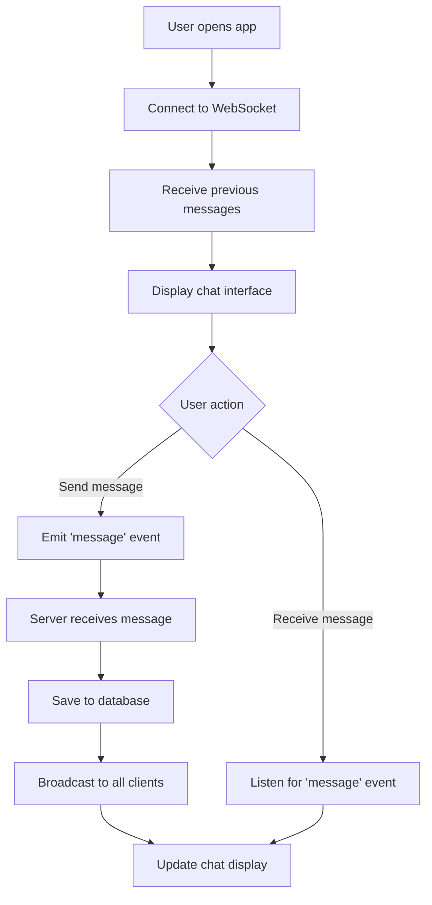

# Details

Name: Khushi Mishra\
College Name: IIT Delhi\
Department: Texile and Fibre Engineering (2022TT12159)


# Messaging App

This is a simple real-time messaging application built with Flask (backend) and Next.js (frontend). It uses WebSockets for real-time communication and SQLite for data storage.

## Features

- Real-time messaging
- Message history persistence
- User authentication (partially implemented)

## Architecture

The application consists of two main components:

1. Backend (Flask)
   - Handles WebSocket connections
   - Manages database operations
   - Broadcasts messages to connected clients

2. Frontend (Next.js)
   - Provides the user interface
   - Manages WebSocket connection to the backend
   - Displays messages in real-time


The database consists of two tables:
- `User`: Stores user information
- `Message`: Stores message history

## Application Flow



## Setup and Running

1. Backend Setup:
Install all the dependencies.
   ```
   python backend.py
   ```

2. Frontend Setup:
   ```
   npm install
   npm run dev
   ```

3. Open `http://localhost:3000` in your web browser.

## Current Limitations and Future Improvements

- The chat is currently public; private messaging could be added.
- Error handling and input validation could be improved.
- The UI could be enhanced for a better user experience.